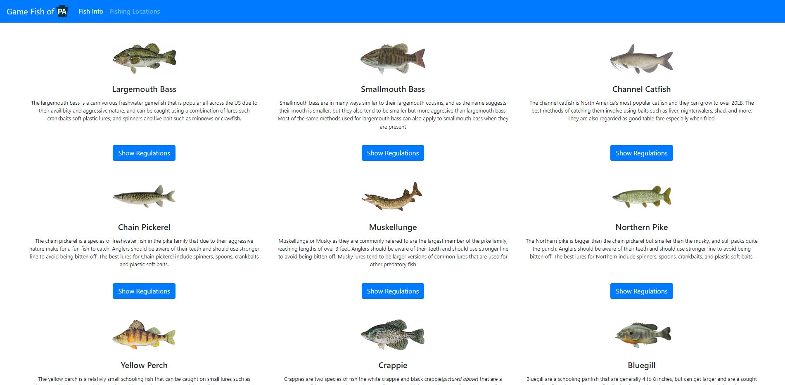
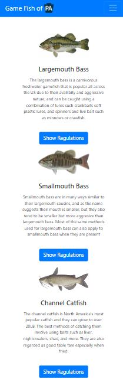

# PA-Fishing
A simple and appealing approach to displaying info about some of the top game fish in Pennsylvania to make an easily understandable user experience
 and allow users to easily see info about the fish and regulations present. Their is also a page that gives users information about lakes to fish at and will then show where that lake is on the map using OpenStreetMap This project is an exploratory look into what state game commissions could do to make their
 regulations more accessible rather than just having a link to pdf which is not as easy to read especially on mobile devices.

## Main Page Screenshots

### Desktop

### Mobile

